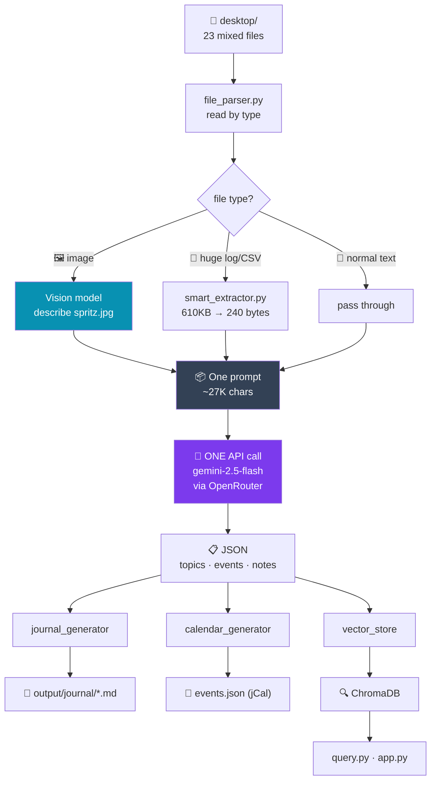
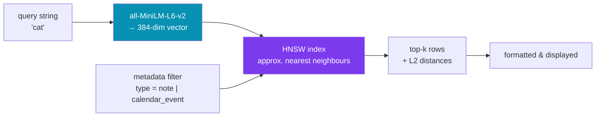

# How It Works

## The idea

You have a desktop folder full of junk — notes, todos, CSVs, logs, a stray screenshot.
This reads all of it in **one LLM call** and gives back three things: topic journals, a
calendar, and a searchable index.

## The flow



## The four ideas worth mentioning

**1. One API call, not 23.**
All files go into a single prompt (~27K chars). Cheaper than looping, and the model sees
relationships *across* files — a date in `todo.txt` can inform an event in `meeting_notes.md`.

**2. Shrink the noise first.**
Machine-generated files are pre-filtered before they ever reach the model.
`api-test-9-25.log` is 610KB of HTTP spam containing maybe four human `#NOTE` comments —
we send only those 240 bytes.

**3. Images get a vision pass.**
`spritz.jpg` can't go into a text prompt. A vision model describes it first
("a tabby kitten asleep on a cat tree"), and that description flows into the main prompt
*and* the search index. So searching **"cat"** returns the photo — even though the word
"cat" appears nowhere in the filename.

**4. Topics aren't hardcoded.**
The model invents 5–7 categories that fit whatever you actually have, instead of forcing
your files into buckets someone picked in advance.

## Storage: how it gets into the vector DB

**Choice: ChromaDB**, embedded mode (`chromadb.PersistentClient`). Picked because it runs
in-process with zero infrastructure — no server, no Docker sidecar, no API key. It persists
to a single SQLite file plus binary index files under `output/vectordb/`. For a
desktop-sized corpus (hundreds of documents) that's the right trade; Pinecone/Weaviate/pgvector
would all mean running something.

Everything lands in **one collection**, `desktop_knowledge`.

### What becomes a document

The LLM's JSON is flattened into two kinds of rows (`src/vector_store.py`):

| Source | ID | Embedded text |
|--------|-----|---------------|
| Note | `note_0`, `note_1`, … | the note content |
| Event | `event_0`, `event_1`, … | `"{title}. {description}"` |

Empty content is skipped. Each row carries metadata used later for filtering:

```python
{
  "type":        "note" | "calendar_event",
  "topic":       "technical_development",
  "source_file": "api-test-9-25.log",
  "tags":        "redis,bug",      # comma-joined; Chroma metadata must be scalar
  "is_image":    "false",           # set by file-extension check
  "date":        "2025-01-15",      # events only
}
```

### Embeddings

No embedding model is specified, so Chroma's **default** is used:
**`all-MiniLM-L6-v2`** (sentence-transformers, ONNX runtime), producing **384-dimensional**
vectors. It runs locally on CPU — embedding is free and never touches OpenRouter.

So two different models are doing two different jobs:

| | Model | Where |
|---|-------|-------|
| Understanding & extraction | `gemini-2.5-flash` | remote, via OpenRouter |
| Embedding & search | `all-MiniLM-L6-v2` | local, in-process |

### Rebuild semantics

Storage is **destructive by design** — every run deletes all existing IDs, then re-adds.
The index always reflects the latest run rather than accumulating duplicates.

---

## Retrieval: how search works

No LLM is involved at query time. The flow is:



1. The query string is embedded by the **same** MiniLM model — that shared vector space is
   what makes semantic matching work.
2. Chroma searches an **HNSW** index (a navigable small-world graph, configured
   `ef_search=100`, `ef_construction=100`, `M=16`). It's approximate nearest-neighbour,
   trading exactness for speed.
3. An optional `where={"type": ...}` clause filters to notes or events only.
4. Top-k rows come back with distances, and are printed (`query.py`) or rendered (`app.py`).

**Distance metric: squared L2** (Chroma's default — `hnsw.space = "l2"`), *not* cosine.

### Why "cat" finds a JPEG

The photo isn't matched as an image. At ingestion the vision model wrote
*"a tabby kitten asleep on a cat tree"*, and **that sentence** was embedded. The query
"cat" lands near it in vector space. Retrieval is pure text-to-text; the image work
already happened upstream.

### This is retrieval, not RAG

Worth being precise about, because it's an easy question to get caught on. The pipeline
retrieves and displays; it never feeds results back to an LLM to compose an answer.

```
this app:  query → embed → retrieve → show rows
RAG:       query → embed → retrieve → stuff into prompt → LLM writes an answer
```

The LLM runs at **ingestion** time (extracting and structuring), not at query time. That's a
deliberate trade, not a missing piece: intelligence is paid for once up front, so every
search afterwards is instant and free. RAG pays a model call on every single query.

Adding the generation step would be small — the retrieval half is already done.

### Known bug: the relevance score is wrong

`src/vector_store.py:145` computes `score = 1 - distance`, which assumes distance is a
cosine similarity bounded to `[0, 1]`. It isn't — it's squared L2, which is unbounded.
Measured on this index:

| Query | L2 distance | Reported "score" |
|-------|-------------|------------------|
| `cat` (best match) | 1.034 | **-0.034** |
| `cat` (3rd) | 1.678 | -0.678 |
| unrelated gibberish | 1.467 | -0.467 |

Every score comes out negative, and a strong match can score *below* a bad one from a
different query. **Ranking order is still correct** — it's sorted by true distance — but the
number shown to users is meaningless. Fixes: switch the collection to
`metadata={"hnsw:space": "cosine"}`, or convert properly with `1 / (1 + distance)`.

---

## Output of a real run

| | |
|---|---|
| Files in | 23 |
| Prompt size | ~27,600 chars |
| API calls | 2 (1 vision + 1 text) |
| Topics found | 5 |
| Notes extracted | 209 |
| Calendar events | 31 |
| Documents indexed | 240 |

## The one trade-off

All-at-once is cheapest and keeps cross-file context, but the model occasionally
skims. Processing file-by-file would be more thorough and more debuggable — and about
20% more expensive. For a desktop folder, cheap and fast wins.
