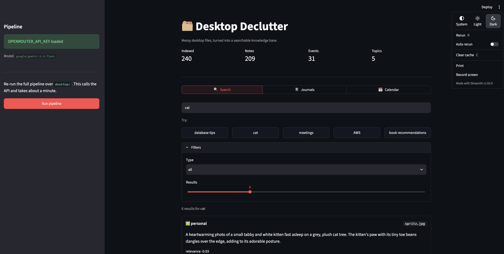
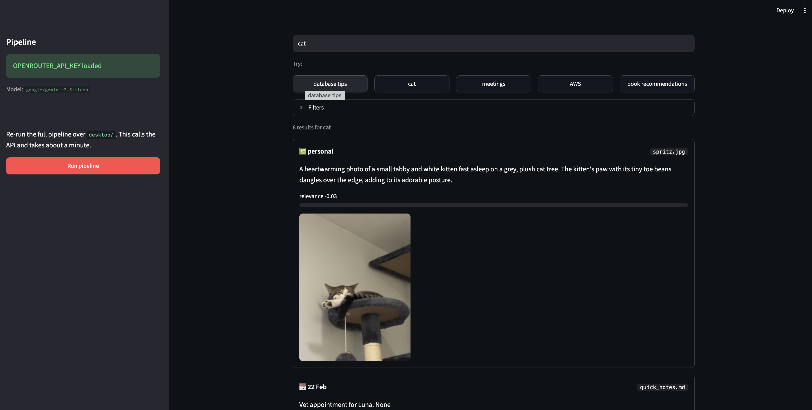
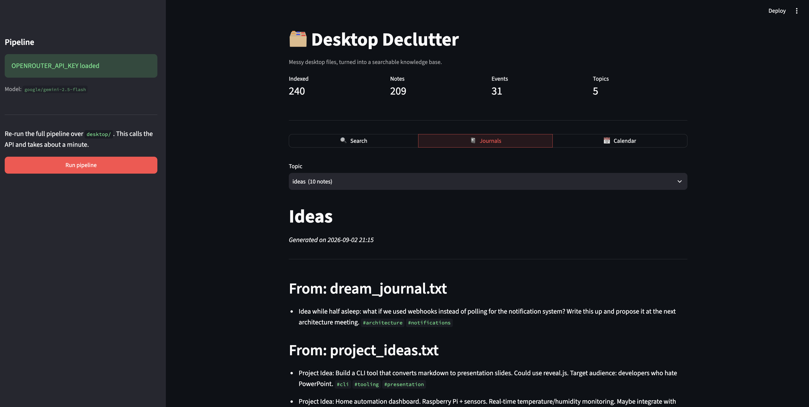
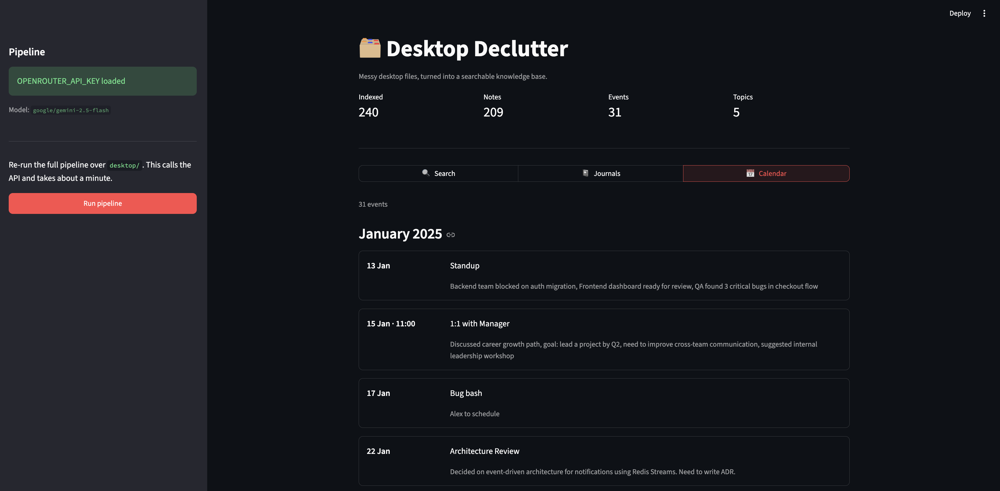

# 🗂️ Desktop Declutter

Turns a messy folder of scattered notes, todos, logs, and screenshots into an organized,
searchable personal knowledge base — using a single LLM call.

**Input:** a directory of mixed files (markdown, text, CSV, JSON, code, images, logs)

**Output:**

| Path | What it is |
|------|-----------|
| `output/journal/*.md` | Notes grouped into topics the model discovers |
| `output/calendar/events.json` | Extracted events in jCal ([RFC 7265](https://datatracker.ietf.org/doc/html/rfc7265)) format |
| `output/vectordb/` | ChromaDB index for semantic search |

A recent run over the 23 sample files in `desktop/` produced 5 topics, 209 notes and
31 calendar events — 240 searchable documents.



---

## Quick start

```bash
# 1. Install
python3 -m venv .venv
.venv/bin/pip install -r requirements.txt

# 2. Configure
cp .env.example .env      # then paste your OpenRouter key into .env

# 3. Build the knowledge base (~1 minute, one API call)
.venv/bin/python main.py

# 4. Explore it
.venv/bin/streamlit run app.py
```

The UI opens at <http://localhost:8501>.

You'll need an [OpenRouter](https://openrouter.ai/keys) API key. `.env` is gitignored —
never commit your key.

---

## The UI

```bash
streamlit run app.py
```

### 🔍 Search

Semantic search across notes and events. Searching **`cat`** surfaces `spritz.jpg` — the
photo is matched through its vision-generated description, then rendered inline — alongside
a vet appointment picked out of `quick_notes.md`.



### 📓 Journals

Browse the generated markdown by topic, with note counts and the originating file for
every entry.



### 📅 Calendar

All extracted events, grouped by month.



The sidebar shows API key status and the active model, and can re-run the whole pipeline.

---

## The CLI

### `main.py` — build the knowledge base

```bash
python main.py                          # process ./desktop → ./output
python main.py ~/Desktop -o ./output    # custom input and output dirs
python main.py --rebuild-vectordb       # re-index existing output, no API call
```

### `query.py` — search from the terminal

```bash
python query.py "database tips"
python query.py "meetings" -n 10             # more results
python query.py "appointments" -t calendar_event   # filter by type
python query.py "ideas" -t note
```

---

## Configuration

Set in `.env` (see `.env.example`):

| Variable | Default | Purpose |
|----------|---------|---------|
| `OPENROUTER_API_KEY` | _required_ | Your OpenRouter API key |
| `OPENROUTER_MODEL` | `google/gemini-2.5-flash` | Model for text extraction |
| `OPENROUTER_VISION_MODEL` | `google/gemini-2.5-flash` | Model for image descriptions |

Any OpenRouter-hosted model works. The default handles both text and vision, so one
model covers the whole pipeline.

---

## Docker

Docker runs the **CLI only** — `app.py` is not copied into the image, so use the local
setup above for the UI.

```bash
# Compose
OPENROUTER_API_KEY="your-key" docker compose up declutter
docker compose run query "meetings"

# Or plain Docker
docker build -t desktop-declutter .
docker run -e OPENROUTER_API_KEY="your-key" \
  -v $(pwd)/desktop:/app/desktop:ro \
  -v $(pwd)/output:/app/output \
  desktop-declutter python main.py
```

---

## How it works

```
desktop/  →  parse  →  smart-extract  →  ONE LLM call  →  journals + calendar + vectordb
```

1. **Parse** every file by type (`src/file_parser.py`).
2. **Smart-extract** large machine-generated files first (`src/smart_extractor.py`) —
   a 610KB log is reduced to the ~240 bytes of human comments it actually contains.
3. **One API call** sends all content together (`src/llm_processor.py`), so the model can
   see relationships across files. Images are described first by a vision model.
4. **Generate** journals, a jCal calendar, and a ChromaDB index.

### Layout

```
main.py              Pipeline entry point
query.py             CLI search
app.py               Streamlit UI
build_vectordb.py    Re-index without an API call
src/
  file_parser.py       Reads files by type
  smart_extractor.py   Shrinks large/noisy files
  llm_processor.py     OpenRouter calls + JSON parsing
  journal_generator.py Writes topic markdown
  calendar_generator.py Writes jCal
  vector_store.py      ChromaDB wrapper
```

See [NOTES.md](NOTES.md) for design decisions, cost comparisons, and trade-offs.

---

## Known issues

- **Relevance scores display as negative.** `vector_store.py` computes `1 - distance`,
  but ChromaDB's default metric is squared L2 (unbounded), not cosine. Ranking order is
  correct; the displayed number isn't meaningful. See [HOW_IT_WORKS.md](HOW_IT_WORKS.md).
- **Stale journal files.** Topic names vary between runs, and `JournalGenerator` doesn't
  remove files from previous runs. The vector store *does* reset itself, so the Journals
  tab can list more topics than actually exist in the current index. Clear
  `output/journal/` before re-running for a clean slate.
- **Topic drift.** The model may pick slightly different topic names each run.
- **The sample `desktop/` and generated `output/` folders contain personal data.** Review
  before publishing this repo.
